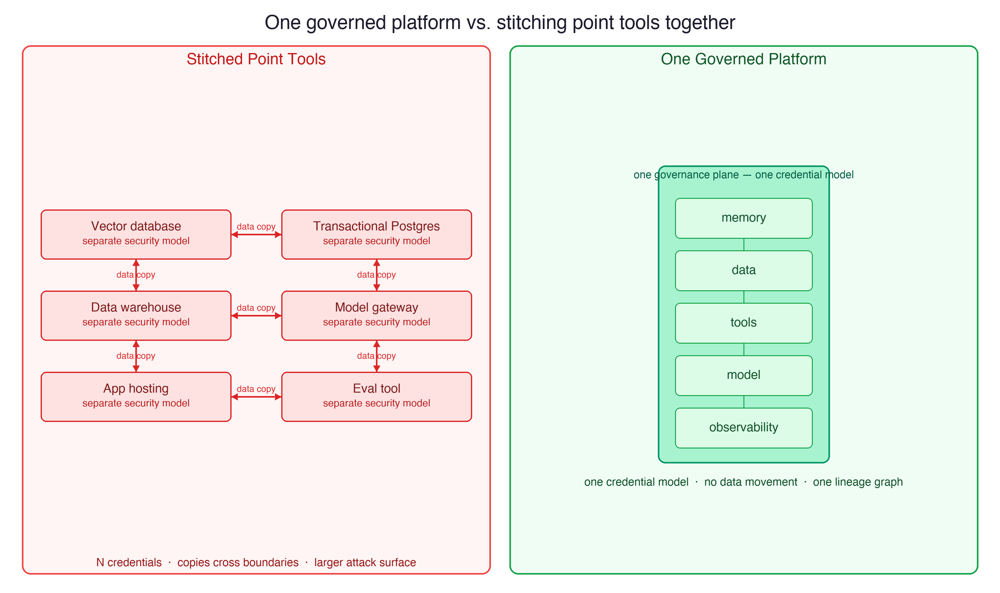
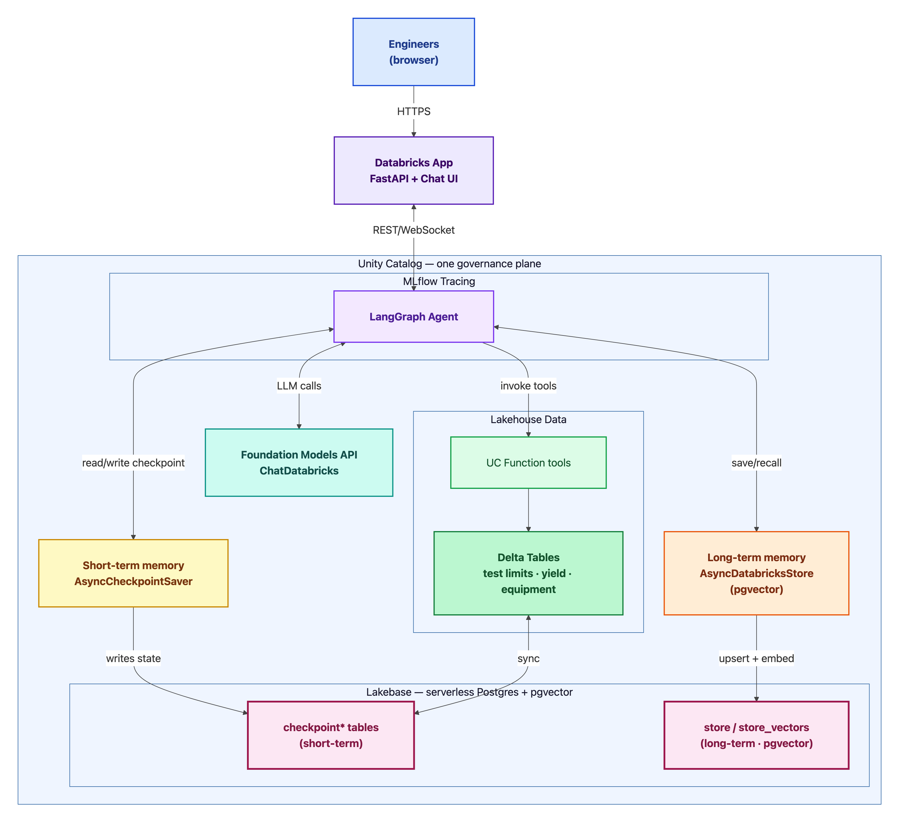
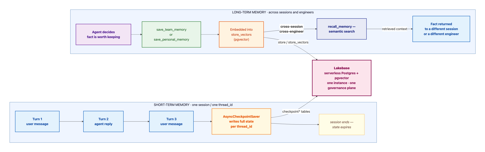

# From Lost Knowledge to Queryable Knowledge: Building a Memory-Driven Agent End-to-End on Databricks

*How short-term and long-term memory, Lakebase, Databricks Apps, and the
Foundation Models API turn a collaborative engineering assistant into an
institutional-knowledge asset — on one governed platform.*

---

## A spec that takes a week and a memory that lasts a day

Picture a senior test engineer authoring a Test Program Specification (TPS) for a
new power-management IC. A TPS is the contract for how a part gets tested on the
manufacturing line: which parameters to measure, the lower and upper spec limits
and guard-bands, the equipment to run each block on, and the order to run them in.
Every one of those choices encodes hard-won judgment — why the quiescent-current
limit is 50 µA and not 60, why this part gets an extra temperature soak, which
handler is flaky on fine-pitch packages.

That judgment is **institutional knowledge**, and today it lives in the
engineer's head and in a sprawl of spreadsheets. When they switch projects or
retire, it walks out the door. The next engineer re-derives it from scratch — or,
worse, repeats a mistake the organization already paid for once.

It is tempting to point an AI assistant at the problem. But the assistants most
teams reach for are *stateless*: they forget everything between calls. They cannot
help with work that is iterative, spans days, and is shared across a team. To
actually help author a spec — and to keep what the team learns while doing it — an
agent needs **memory**. And, as we will see, the moment you take memory seriously,
you discover it is really a *data and governance* problem. That is exactly where a
unified platform earns its keep.

This post builds that agent — call it **TestForge** — end-to-end on Databricks,
and explains why each layer belongs on the same platform. The full, deployable
code is in the companion repo.

---

## Two kinds of memory, and why you need both

"Agent memory" is two different mechanisms with different scopes and lifetimes.
Getting them straight is the foundation for everything else.

| | **Short-term memory** | **Long-term memory** |
|---|---|---|
| What it stores | The full conversation/session state | Curated facts the agent chooses to keep |
| Scope | One editing session (`thread_id`) | Across sessions, days, and engineers |
| Keyed by | `thread_id` | a namespace (project, user) |
| Retrieval | Replayed automatically each turn | Semantic search over embeddings |
| Survives a new session? | No | Yes |

**Short-term memory** keeps a single drafting session coherent. As the engineer
refines a parameter across a dozen turns — "tighten that limit", "what did we just
set?", "add a Vmin shmoo before it" — the agent needs the running state of the
draft. In LangGraph this is a *checkpointer*: it writes the entire graph state
after every step, keyed by a `thread_id`.

**Long-term memory** is the institutional-knowledge accumulator. When an engineer
decides something worth keeping — "for this family we set the IDDQ USL to 50 µA
after the Q2 field returns" — the agent saves it as a curated fact, embedded as a
vector so it can be *semantically recalled* later, in a different session, by a
different engineer. This is the layer that stops knowledge from walking out the
door.

> **Memory is not the system prompt.** The system prompt is static instructions.
> Memory is dynamic: it grows with every decision the team makes and is retrieved
> on demand. A prompt tells the agent *how to behave*; memory tells it *what the
> team already knows*.

---

## The turn: memory is a data and governance problem

Here is the pivot. The instant long-term memory becomes durable, cross-user, and
semantically searchable, you have built a database — with embeddings, access
control, audit, and lineage requirements. And it cannot live off on its own,
because the agent's recommendations must be **grounded in the same test and yield
data** the organization already governs.

The naive architecture bolts together a standalone vector database, a separate
transactional Postgres, a data warehouse, a model gateway, an app host, and an
eval tool. Six services, six security models, and several copies of your data
crossing boundaries to keep them in sync. Every one of those seams is a place for
governance to leak and for the system to drift.

The alternative is to put the agent, its short-term memory, its long-term memory,
the tools it calls, the model it runs on, and the data it grounds in **inside one
governance boundary**. That is the architecture this post builds.



---

## Architecture



Every component maps to one role, and Unity Catalog governs all of them:

- **Unity Catalog + Delta** — the governed manufacturing data (historical test
  limits, yield by test block, the equipment catalog) *and* the UC Function tools
  the agent calls.
- **Lakebase** (serverless Postgres + pgvector) — both memory layers, in the same
  database: `checkpoint*` tables for short-term, `store` / `store_vectors` for
  long-term. Autoscaling, scale-to-zero, branchable, and syncable with Delta.
- **Foundation Models API** — the reasoning model, via `ChatDatabricks`.
- **Databricks Apps** — the collaborative chat UI, served on-platform with
  built-in auth and resource binding.
- **MLflow** — traces every run, tool call, and memory recall in the same lineage
  graph as the data and the model.

---

## Building it

The agent is built the way the enablement labs build it; what changes for
collaboration is the long-term memory design. Each snippet below is real and
runnable.

### 1. Ground the agent in governed data (UC Function tools)

Tools are governed Unity Catalog objects, not loose API calls. The function's
`COMMENT` is load-bearing — it is what the model reads to decide when to call it.

```sql
CREATE OR REPLACE FUNCTION ${catalog}.tps.recommend_test_limits(
  product_family STRING COMMENT 'e.g. "PMIC-Buck-A"',
  parameter_name STRING COMMENT 'e.g. "Iddq_quiescent_uA"'
)
RETURNS TABLE (parameter_name STRING, unit STRING, lsl DOUBLE, usl DOUBLE,
               typical_value DOUBLE, cpk DOUBLE, revision STRING,
               effective_date DATE, authored_by STRING)
READS SQL DATA
COMMENT 'Historical LSL/USL, typical value, Cpk, revision and author for a
         product family + parameter, newest first. Use to ground a limit.'
RETURN SELECT ... ;
```

```python
from databricks_langchain import UCFunctionToolkit
uc_tools = UCFunctionToolkit(function_names=[
    f"{CATALOG}.tps.recommend_test_limits",
    f"{CATALOG}.tps.yield_risk_by_block",
    f"{CATALOG}.tps.lookup_equipment_for_test",
]).tools
```

### 2. Short-term memory: a checkpointer on Lakebase

```python
from databricks_langchain import AsyncCheckpointSaver
async with AsyncCheckpointSaver(project=LAKEBASE_PROJECT, branch="production") as cp:
    graph = workflow.compile(checkpointer=cp)
    # same thread_id across turns -> the draft stays coherent
```

### 3. Long-term memory: a vector store, and the collaboration design

The store is created once and lives in Lakebase:

```python
from databricks_langchain import AsyncDatabricksStore
async with AsyncDatabricksStore(
    project=LAKEBASE_PROJECT, branch="production",
    embedding_endpoint="databricks-gte-large-en", embedding_dims=1024,
) as store:
    await store.setup()   # creates store / store_vectors (pgvector)
```

The labs scope memory to a single user — `("users", user_id)`. To make the agent
a *team* asset, TestForge uses **two namespaces**: a shared one for the project,
and a personal one for the engineer.

```python
@tool
async def save_team_memory(key, value, config, store: Annotated[BaseStore, InjectedStore]):
    """Shared project decision every engineer inherits."""
    await store.aput(("project", config["configurable"]["project_id"]), key, {"content": value})

@tool
async def save_personal_memory(key, value, config, store: Annotated[BaseStore, InjectedStore]):
    """This engineer's authoring preference only."""
    await store.aput(("user", config["configurable"]["user_id"]), key, {"content": value})

@tool
async def recall_memory(query, config, store: Annotated[BaseStore, InjectedStore]):
    """Search BOTH namespaces; tag each hit [team] or [personal]."""
    team = await store.asearch(("project", config["configurable"]["project_id"]), query=query, limit=5)
    personal = await store.asearch(("user", config["configurable"]["user_id"]), query=query, limit=5)
    ...
```

That single design choice — a shared `("project", project_id)` namespace — is what
lets a decision one engineer makes on Monday be recalled by a teammate on Friday.

### 4. One graph, both memory layers

```python
graph = workflow.compile(checkpointer=checkpointer, store=store)
```

`checkpointer=` activates short-term memory; `store=` activates long-term memory
and makes it available to any tool annotated with `InjectedStore`. Both connect to
the same Lakebase instance — different tables in the same database.

### 5. Serve it as a Databricks App

A thin FastAPI server (`GET /` serves the chat UI, `POST /invocations` runs the
agent) deploys as a Databricks App. The app's service principal is granted a
Lakebase role — no separate credentials, no separate hosting. Memory connections
open and close per request via async context managers, so there are no leaks.

---

## Why on this platform

Now that the build is concrete, the capability wins are easy to name. None of them
require naming a competitor — they fall out of *unification*.

| Dimension | One governed platform | Stitching point tools |
|---|---|---|
| Governance | One plane (Unity Catalog) over data, memory, tools, models | A separate access model per tool, reconciled by hand |
| Data movement | Memory sits next to analytical data; Delta↔Lakebase sync | Copies replicated across services; drift and sync jobs |
| Memory as asset | A queryable, auditable SQL table | An opaque store you can't analyze |
| Security surface | One boundary, one credential model, SP binding | N credentials, N IAM models, N audit logs |
| Latency / locality | Memory, tools, data co-located | Cross-service hops on every call |
| Ops burden | Serverless, scale-to-zero, fewer moving parts | Provision, patch, and scale each service |
| Cost model | One bill; idle memory scales to zero | N bills; vector stores often bill while idle |
| Observability | MLflow traces in one lineage graph | Separate traces, manual correlation |

---

## Code-first or low-code: Foundation Models API vs Agent Bricks

There are two ways to author this on the same substrate. The code-first path —
Foundation Models API + LangGraph, shown above — gives you full control of the
graph and the dual-namespace memory; reach for it when *persistent, cross-user
institutional memory is the product*. **Agent Bricks** is the low-code path: point
a Knowledge Assistant at the same governed SOP docs and a Genie/SQL path over the
same tables, and you get grounded answers fast with very little code.

The important part: the substrate underneath — Unity Catalog governance, Lakebase,
the model endpoint, MLflow — is identical. You are choosing an authoring surface,
not a stack, and you can run both side by side.

---

## The payoff: memory you can query, audit, and analyze

Because long-term memory is a real table in Lakebase under Unity Catalog, the
team's accumulated knowledge is itself a first-class data asset:

```sql
SELECT prefix, key, value->>'content' AS decision, updated_at
FROM store
WHERE prefix LIKE 'project%'
ORDER BY updated_at DESC;
```

Three things follow that an opaque, standalone vector store cannot match. You can
**run analytics** on the decisions the organization is accumulating. You can
**audit** who knew what and when. And it is **access-controlled** like any other
Unity Catalog asset — sitting right next to the test and yield data the agent
reasons over, with no copies leaving the boundary.

That is the whole arc: short-term memory makes drafting coherent, long-term memory
captures the institutional knowledge, and putting it all on one governed platform
turns that knowledge from a liability that walks out the door into an asset the
organization keeps.

---

## Observability and evaluation

Memory agents are non-deterministic, so they must be observed and evaluated — and
that is on-platform too. `mlflow.langchain.autolog()` captures every run as a
trace: the span tree shows each tool call, each node transition, and *exactly when
`recall_memory` fired*. The companion eval set scores two things that matter for a
memory agent: did it recall the right institutional fact, and did it ground its
limit recommendation in real yield data? Traces, runs, data, and model all live in
the same lineage graph.



---

## Try it

The complete, deployable demo — the dual-memory agent, the FastAPI app, the
synthetic manufacturing data, the UC Function tools, the eval set, and the
verification scripts — is in the companion repository. Provision a Lakebase
project, generate the data, deploy the app, and watch a decision made in one
session resurface, grounded and attributed, for a teammate in the next.

*Build the agent, its memory, and the data it reasons over in one place — and keep
what your team learns.*
